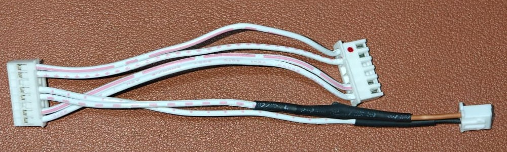

# DWIN HMI Control

FreeRTOS-based dual-core ESP32 controller for DWIN/DGUS HMI display.
Includes firmware (PlatformIO) that implements a UART protocol layer, plus
Python scripts to emulate/monitor DWIN serial traffic for development and
testing.

## Repository Layout

- `dwin_ui/` — UI files used by the HMI.
- `firmware/` — PlatformIO project for the ESP32 firmware.
  - `platformio.ini` — build configuration (esp32dev environment).
  - `src/` — firmware source files (`main.cpp`, `vp_dwin.cpp`, etc.).
  - `include/` — public headers (`vp_dwin.h`, `global.h`, ...).
- `scripts/` — utility scripts for serial port discovery, communication and emulation.

## Hardware & Wiring

- Common requirements:
  - ESP32 operates at 3.3V; many DWIN displays use 5V TTL UART.
  - Always share a common ground (connect GND of ESP32 and DWIN).
  - Recommended: use a proper bidirectional level shifter for robust designs.

### Pin Mapping

- DWIN UART (RX2/TX2) ↔ ESP32 `Serial2` (`RX = GPIO16`, `TX = GPIO17`)
- Default baud for DWIN communication: 115200 (see `DGUS_BAUD` in firmware).
- Since we are using the existing hardware board, we need to create the required connector to connect the display to the ESP controller board.

### DWIN Connector Wiring

```
JST 8-PIN CONNECTOR     JST 6-PIN CONNECTOR
────────────────────────────────────────────
Pin 1  GND  ----------- Pin 6  (GND)
Pin 2  GND  ----------- Pin 5  (GND)
Pin 3  RX4  ----------- UNUSED
Pin 4  RX2  ----------- to UART (ESP32 TX)
Pin 5  TX2  ----------- to UART (ESP32 RX)
Pin 6  TX4  ----------- UNUSED
Pin 7  +5V  ----------- Pin 2  (+5V)
Pin 8  +5V  ----------- Pin 1  (+5V)
```

### UART Connector Wiring

```
8-PIN JST Pin5 (TX2) ───[1.8kΩ]──┬───────► ESP32 GPIO16 (RX)
                                 │
                                 │
                             [3.3kΩ]
                                 │
                                GND

8-PIN JST Pin4 (RX2) ◄──────────────────── ESP32 GPIO17 (TX)
```

## Reference Connectors




## Voltage Divider (DWIN TX → ESP32 RX)

Use a two-resistor divider to bring 5V -> ~3.3V for the ESP32 RX pin.

Example:

- Rtop = 1.8 kΩ, Rbot = 3.3 kΩ

Vout = 5V × (Rbot / (Rtop + Rbot)) = 5V × (3.3 / 5.1) ≈ 3.24 V

Alternative resistor set: Rtop = 3.3 kΩ, Rbot = 6.2 kΩ → Vout ≈ 3.26 V

Note: ESP32 TX is 3.3V and is usually recognized as logic HIGH by DWIN, but a
level shifter is recommended for production or noisy environments.

### Recommended Protections

- 10 µF electrolytic: bulk filtering on 5V rail
- 100 nF ceramic: local decoupling near power pins
- 220 Ω series resistors: optional current limiting on TX lines
- 3.6 V Zener (optional): over-voltage clamp on ESP32 RX input

## Test & Serial Emulator

- Find connected ESP32 COM ports:

  ```bash
  python scripts/find_com_port.py
  ```

- Monitor and emulate DWIN frames with the more feature-complete emulator:

  ```bash
  python scripts/serial_emulator.py --port COMx --baud 115200
  ```

- On Windows, ports will be as "COMx". On Unix-like systems, they'll
  be like "/dev/ttyUSB0" or "/dev/ttyACM0".
