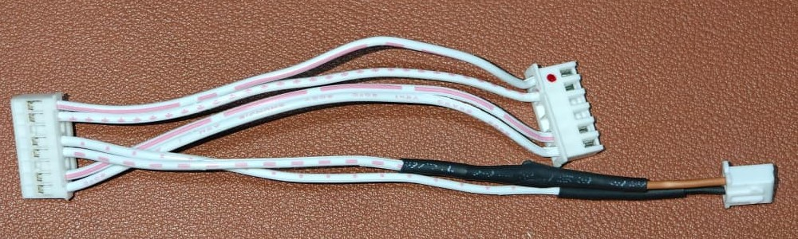
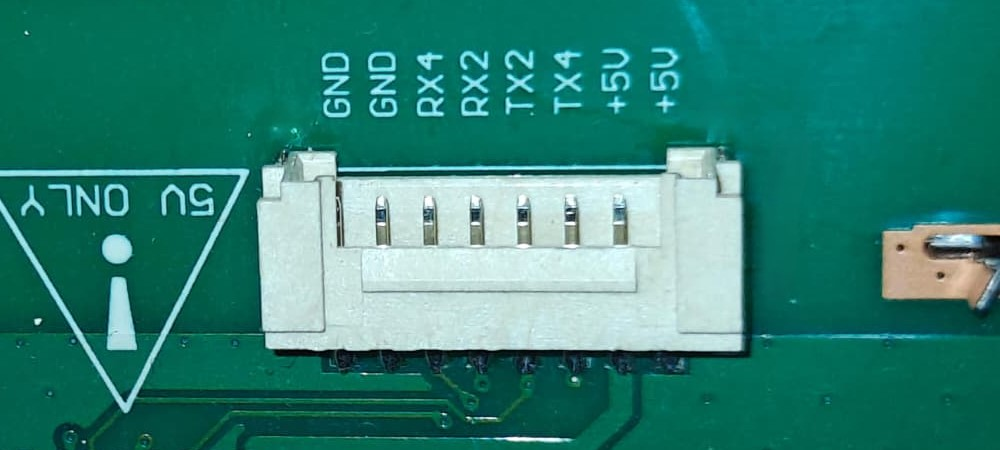

# DWIN HMI Control

FreeRTOS-based dual-core ESP32 controller for DWIN/DGUS HMI display.
Includes firmware (PlatformIO) that implements a UART protocol layer, plus
Python scripts to emulate/monitor DWIN serial traffic for development and
testing.

## Repository Layout

- `dwin_ui/` — UI files used by the HMI.
- `firmware/` — PlatformIO project for the ESP32 firmware.
  - `platformio.ini` — build configuration (esp32dev environment).
  - `src/` — firmware source files (`main.cpp`, `vp_dwin.cpp`, etc.).
  - `include/` — public headers (`vp_dwin.h`, `global.h`, ...).
- `scripts/` — utility scripts for serial port discovery, communication and emulation.

## Hardware & Wiring

- DWIN UART (RX2/TX2) - ESP32 `Serial2` (`RX = GPIO16`, `TX = GPIO17`).
- Default baud for DWIN communication: 115200 (see `DGUS_BAUD` in firmware).
- Always share a common ground (connect the GND of the ESP32 and the DWIN display).
- Since we are using the existing hardware board, a custom connector must be created to connect the display to the ESP32 controller board.

### DWIN Connector Wiring

```code
JST 8-PIN CONNECTOR     JST 6-PIN CONNECTOR
────────────────────────────────────────────
Pin 1  GND  ----------- Pin 6  (GND)
Pin 2  GND  ----------- Pin 5  (GND)
Pin 3  RX4  ----------- UNUSED
Pin 4  RX2  ----------- to UART (ESP32 TX)
Pin 5  TX2  ----------- to UART (ESP32 RX)
Pin 6  TX4  ----------- UNUSED
Pin 7  +5V  ----------- Pin 2  (+5V)
Pin 8  +5V  ----------- Pin 1  (+5V)
```

### UART Connector Wiring

```code
8-PIN JST Pin5 (TX2) ───[1.8kΩ]──┬───────► ESP32 GPIO16 (RX)
                                 │
                                 │
                             [3.3kΩ]
                                 │
                                GND

8-PIN JST Pin4 (RX2) ◄──────────────────── ESP32 GPIO17 (TX)
```

## Reference Connectors




## Voltage Divider (DWIN TX → ESP32 RX)

Use a two-resistor divider to bring 5V -> ~3.3V for the ESP32 RX pin.

```code
Example:

Rtop = 1.8 kΩ, Rbot = 3.3 kΩ
Vout = 5V × (Rbot / (Rtop + Rbot)) = 5V × (3.3 / 5.1) ≈ 3.24 V

Alternative resistor set: Rtop = 3.3 kΩ, Rbot = 6.2 kΩ → Vout ≈ 3.26 V
```

Note: ESP32 TX is 3.3V and is usually recognized as logic HIGH by DWIN, but a
level shifter is recommended for production or noisy environments.

## Test & Serial Emulator

- Find connected ESP32 COM ports:

  ```bash
  python scripts/find_com_port.py
  ```

- Monitor and emulate DWIN frames with the more feature-complete emulator:

  ```bash
  python scripts/serial_emulator.py --port COMx --baud 115200
  ```

- On Windows, ports will be as "COMx". On Unix-like systems, they'll
  be like "/dev/ttyUSB0" or "/dev/ttyACM0".

## Recommended Protections

- A 10 µF electrolytic capacitor provides bulk filtering on the 5 V rail.
- A 100 nF ceramic capacitor provides local decoupling near the power pins.
- Optional 220 Ω series resistors can be used for current limiting on TX lines.
- An optional 3.6 V Zener diode can be used to clamp over-voltage on the ESP32 RX input.

## HMI Display – [SD Card Instructions](dwin_ui/README.md)

See the DWIN display SD card download instructions for step-by-step guidance on:

- Preparing the SD card (FAT32, 4096-byte allocation)
- Copying the `DWIN_SET` folder
- Downloading files to a DWIN HMI display

## Sample Debug Output

```code
18:55:58.390 > [BOOT] Initializing communication...
18:55:59.934 > [BOOT] Hostname: E-65F4
18:55:59.937 > [BOOT] UI Version: v1.0.8
18:55:59.938 > [BOOT] FW Version: v1.0.9
18:55:59.941 > [BOOT] HW Version: v1.0.0
18:55:59.943 > [BOOT] WiFi STA: 1, AP: 0
18:55:59.945 > [BOOT] WiFi SSID: Network
18:55:59.948 > [BOOT] Light: 0, Water: 0, Fan: 0
18:55:59.951 > [BOOT] Initializing DWIN HMI
18:56:00.055 > [HMI] Task started on core 1
18:56:00.057 > [HMI] Processing full update request
18:56:00.155 > [BOOT] Tasks created. Setup complete!
18:56:00.159 > [SYNC] Task started on core 1
18:56:00.161 > [SYNC] Boot automation check completed
18:56:00.164 > [WiFi] Task started on core 0
18:56:00.167 > [WiFi] Attempting to connect to: Network
18:56:03.292 > [WiFi] Retries: 1, delay: 3 sec
18:56:03.314 > [WiFi] Connected! IP Address: 192.168.0.197
18:56:03.330 > [OTA] Initialized, Hostname: E-65F4, Port: 3232
18:56:03.330 > [mDNS] DNS responder started!
18:56:03.339 > [NTP] Time not sync, Calling forceUpdate
18:56:04.413 > [NTP] Time successfully set: 18:56:03
18:56:27.603 > [HMI] Light auto setting changed to ENABLED
18:56:30.233 > [HMI] Spray auto setting changed to ENABLED
18:56:32.156 > [HMI] Fan auto setting changed to ENABLED
19:00:01.496 > [SYNC] Auto Fan ON triggered
19:00:01.798 > [SYNC] Auto Spray ON triggered
19:00:31.561 > [SYNC] Auto Spray OFF triggered
19:15:01.572 > [SYNC] Auto Light ON triggered
19:25:58.470 > [NTP] Time not sync, Calling forceUpdate
19:26:00.159 > [NTP] Time successfully set: 19:25:59
19:30:01.224 > [SYNC] Auto Fan OFF triggered
19:45:00.969 > [SYNC] Auto Light OFF triggered
20:00:30.861 > [SYNC] Auto Spray ON triggered
20:01:01.661 > [SYNC] Auto Spray OFF triggered
21:01:01.498 > [SYNC] Auto Spray ON triggered
21:01:31.362 > [SYNC] Auto Spray OFF triggered
21:56:07.036 > [NTP] Time not sync, Calling forceUpdate
21:56:08.372 > [NTP] Time successfully set: 21:56:07
22:01:31.535 > [SYNC] Auto Spray ON triggered
22:02:01.421 > [SYNC] Auto Spray OFF triggered
22:56:10.115 > [NTP] Time not sync, Calling forceUpdate
22:56:11.643 > [NTP] Time successfully set: 22:56:11
23:02:00.745 > [SYNC] Auto Spray ON triggered
23:02:30.863 > [SYNC] Auto Spray OFF triggered
23:26:11.684 > [NTP] Time not sync, Calling forceUpdate
23:26:13.177 > [NTP] Time successfully set: 23:26:12
```
